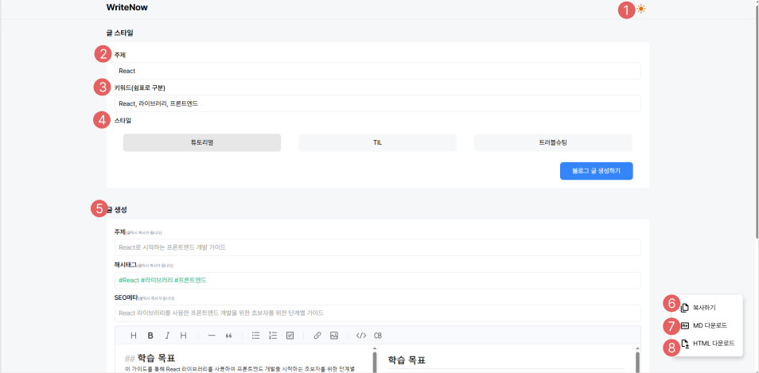
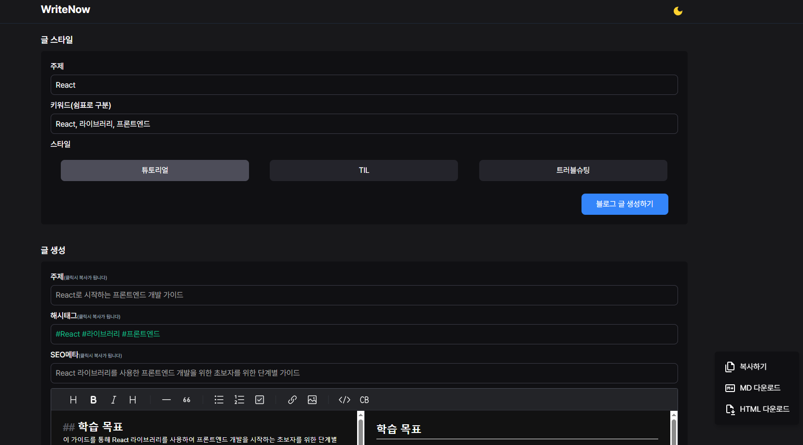
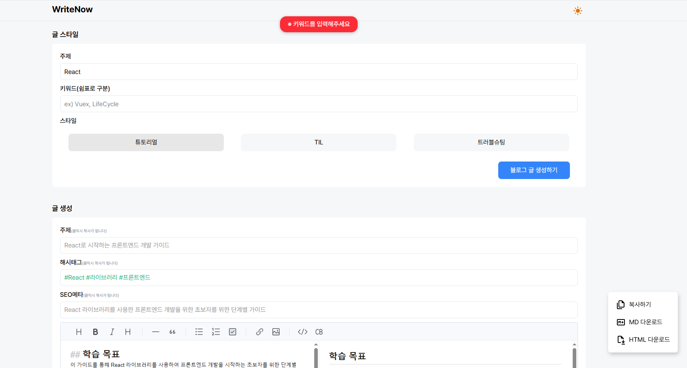
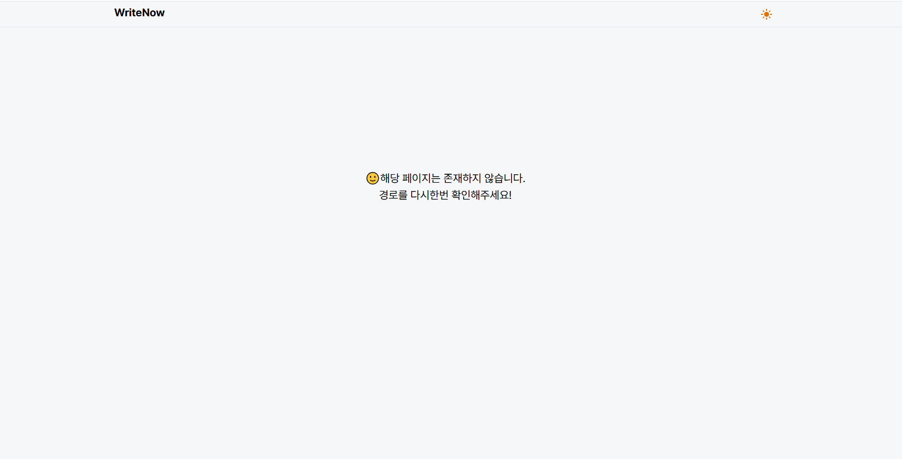
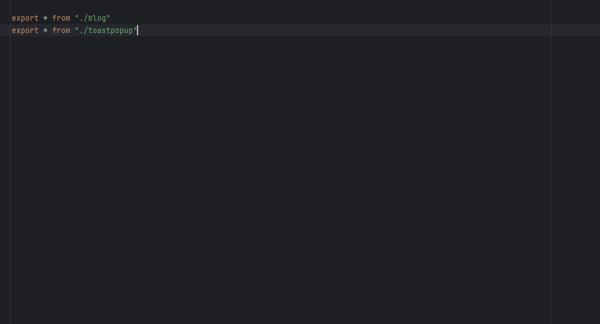

## 프로젝트 소개

개요: Chat gpt 3.5 turbo를 이용하여 개발주제를 입력시 블로그 생성글 생성<br/>

<strong>WriteNow</strong> 의미: right now 바로 지금처럼 언어유희 발음으로 제작

```bash
/* local환경에서는 OPENAI_API_KEY값이 필수라서 .env.local에 개인 키값을 줘야합니다 */
npm install -g pnpm -- pnpm 글로벌로 설정
pnpm i
pnpm dev
```
---
## 라이브러리
라이브러리|          사용이유           |
---|:-----------------------:|
`react19` |   react-compiler 기능으로 최적화를 좀 더 쉽게 하기 위해서 19버전 사용    |
`toastUI` |     다른 에디터보다 지원하는게 많아서 채택      |
`marked` | html 다운기능을 하고나서 파일을 열때 한눈에 텍스트가 한줄로만 나오기때문에 줄바꿈을 위해서 사용 |
`openai` |     ai를 이용하는 블로그 글 생성이라서 사용     |
`prismjs` |      본문 내용에 코드등을 한눈에 보이기 위해서 사용                    |
`zustand` |  redux같은 경우는 소규모 프로젝트에 사용하기는 무거워서 recoil, zustand 중에 zustand가 lts 지원과 러닝커브가 낮아 채택                       |

---
## 주요기능


1. 다크모드로써 CSS 애니메이션을 줘서 바꿔질때 시각적으로 변화를 줬음
>
2. 주제 값을 넣지 않을경우 토스트 팝업이 나오게 제작
>
3. 키워드 값을 넣지 않을경우 토스트 팝업이 나오게 제작
>
4. 스타일 기본값은 튜토리얼로 3개 값중 하나만 선택 가능하도록 제작
5. 모든 값을 넣고 `생성하기` 버튼을 누르면 글생성 본문이 나옴
> 주제, 해시태그, SEO메타 각 값들이 나온 섹션을 클릭시 값이 복사 됨
6. 에디터에 있는 내용을 복사
7. MD다운로드를 하면 본문 내용을 markdown으로 다운
8. HTML다운로드를 하면 본문 내용을 html로 다운

9. 경로를 잘못입력할때 커스텀 404 페이지 제작
>

---
## 디렉토리 구조
```
src
├─app 
│  ├─(main)                   //메인화면
│  │  └─_components           //메인화면에만 따로 사용하는 컴포넌트
│  └─api 
│      └─generate             // openAI api를 위해서 만든 backend
├─components                  // 공통컴포넌트
│  ├─button                   // 버튼
│  │  └─toggle                // 토글
│  ├─data-section             //data 섹션 부분을 보여주는 컴포넌트
│  ├─layout                   // 레이아웃
│  │  ├─content               // 콘텐츠 부분
│  │  └─header                // 헤더 부분
│  ├─toast-popup              // 성공, 실패시 보여주는 토스트 팝업
│  └─toastui-editor           // toastUIEditor 라이브러리
├─hooks                       // useDarkMode, useResize 커스텀 훅 제작 (useResize는 반응형을 위해)
├─store                       // 다크모드를 위해 사용하는 전역상태관리
└─types                       // blog.ts, toastpopup.ts interface type이면서 index.ts에 묶어놓아 해당 타입이 
                              // 필요한곳에 사용할때 간략하게 import 문을 작성하기 위해서 index.ts에 묶어놓음
``` 
>